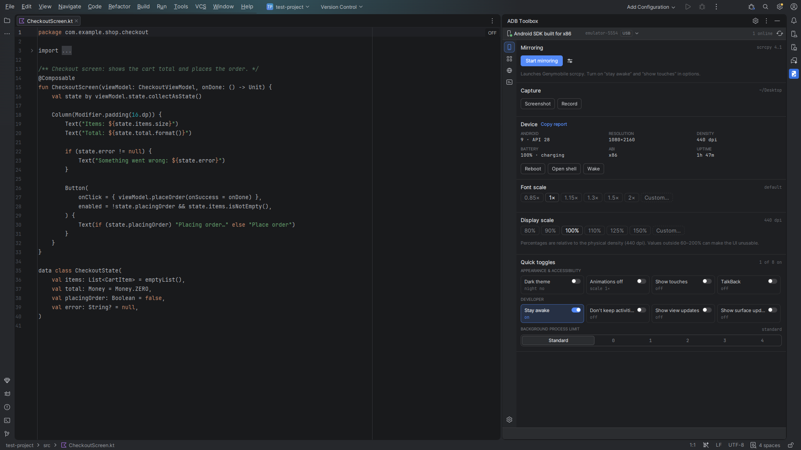
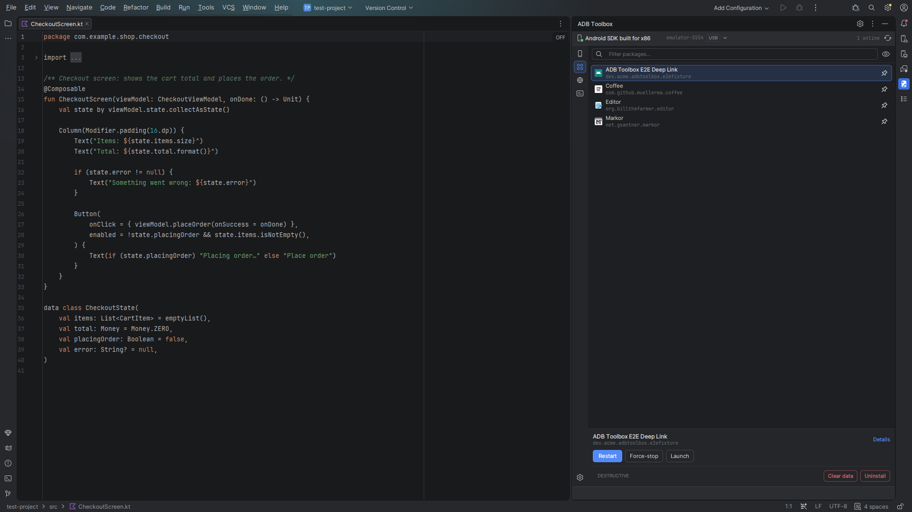
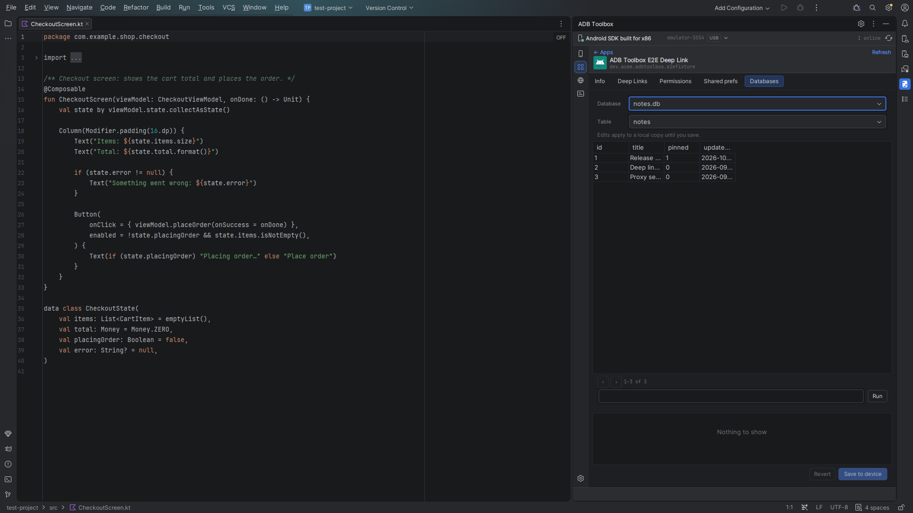
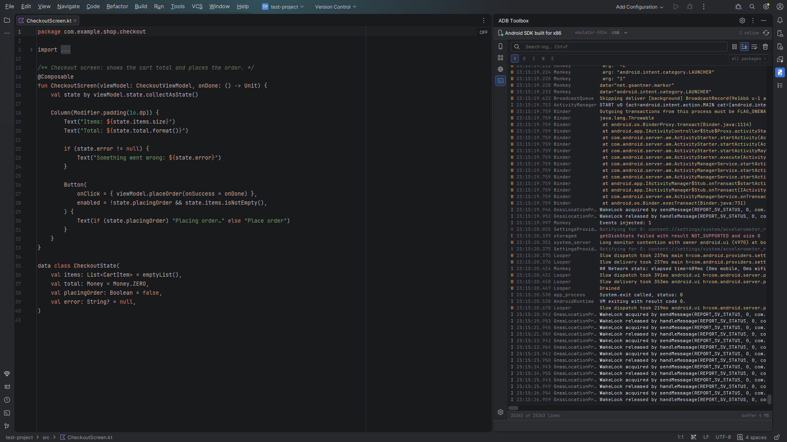

# ADB Toolbox

Control your Android device from Android Studio or IntelliJ IDEA without opening a terminal.
ADB Toolbox puts the adb commands you run every day into one tool window: mirroring, screenshots,
app data, developer toggles, proxy and logcat.

## Features

**Device**
- Device facts at a glance: model, Android version, battery, screen size and density.
- Screenshots, including full-page screenshots of scrolling screens, and screen recording.
- Mirroring with [scrcpy](https://github.com/Genymobile/scrcpy), with its common options.
- Font scale and display density presets, custom values and one-click reset.
- Quick toggles: dark theme, animations, show touches, TalkBack, stay awake, don't keep
  activities, show view/surface updates and the background process limit.

**Apps**
- Searchable list of installed apps with launcher icons; pin the ones you work on.
- Launch, restart, force-stop, clear data and uninstall.
- App details: edit shared preferences and SQLite databases in place, grant and revoke runtime
  permissions, list deep links and open any URI in the app.

**Network**
- Set or clear a device-wide HTTP proxy (handy for Charles, Proxyman or mitmproxy).
- Throttle the network speed and latency of an emulator.

**Logcat**
- Fast live stream with level filter, search, package filter, pause, autoscroll and line wrap.

Also: several devices at once, pairing over Wi-Fi, and light and dark themes that match the IDE.

| Apps | App databases | Logcat |
|---|---|---|
|  |  |  |

## Installation

In Android Studio or IntelliJ IDEA open **Settings → Plugins → Marketplace**, search for
**ADB Toolbox** and click **Install** — or install it from the
[JetBrains Marketplace page](https://plugins.jetbrains.com/plugin/34857-adb-toolbox).

Or download the ZIP from [Releases](https://github.com/dkej123/AndroidDeveloperToolkit/releases)
and use **Settings → Plugins → ⚙ → Install Plugin from Disk…**.

## Requirements

- Android Studio or IntelliJ IDEA **2024.2 or newer**, on macOS, Windows or Linux.
- **adb** from the Android SDK platform-tools. If you have Android Studio, you already have it.
- **scrcpy** for mirroring only (`brew install scrcpy`, `winget install scrcpy` or your Linux
  package manager). Without it the mirroring controls are greyed out; everything else works.
- A device with USB debugging enabled, or an emulator.

ADB Toolbox finds adb and scrcpy on its own: in the IDE's Android SDK, the default SDK location,
`ANDROID_HOME` and your `PATH`. If yours live somewhere else, set the paths in
**Settings → Tools → ADB Toolbox**.

## Getting started

1. Connect a device or start an emulator.
2. Open the **ADB Toolbox** tool window on the right edge of the IDE.
3. Pick the device in the selector at the top. To connect over Wi-Fi, open the selector and choose
   **Pair device over Wi-Fi…**.

## Settings

**Settings → Tools → ADB Toolbox**: adb and scrcpy paths, where screenshots and recordings are
saved, the logcat buffer size, and custom TalkBack commands for devices where the default does not
work.

## Problems and feedback

Please [open an issue](https://github.com/dkej123/AndroidDeveloperToolkit/issues). It helps a lot to
attach a diagnostics bundle: **Help → ADB Toolbox Diagnostics → Collect Diagnostics…** writes a ZIP
with the plugin log and the adb state (details in [docs/diagnostics.md](docs/diagnostics.md)).

## Contributing

Building and testing the plugin is described in [docs/development.md](docs/development.md).

## License

[MIT](LICENSE)
